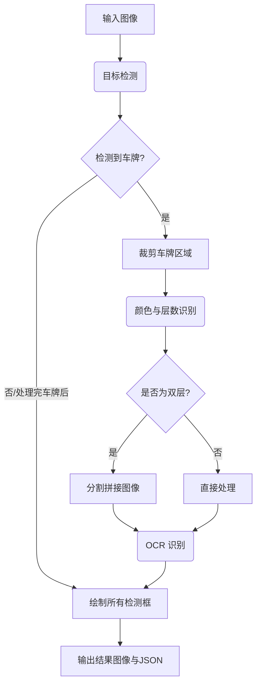

# ONNX 车辆和车牌识别

本项目提供了一个使用 ONNX 模型的完整的车辆和车牌识别流程。它可以在图像中检测车辆和车牌，并对每个检测到的车牌进行号码、颜色以及单双层属性的识别。

## 功能特性

- **车辆与车牌检测**: 使用 ONNX 模型检测图像中的车辆和车牌。
- **车牌号码识别 (OCR)**: 识别车牌上的字符。
- **车牌属性识别**: 识别车牌的颜色（如蓝色、黄色、绿色）和层类型（单层/双层）。
- **灵活独立**: 使用 ONNX Runtime 在本地运行，不依赖特定的深度学习框架。
- **详细输出**: 保存带有边界框和识别结果的标注图像，并提供包含详细信息的结构化 JSON 文件。

## 处理流程



## 安装指南

1.  **克隆仓库:**
    ```bash
    git clone https://github.com/your-username/onnx_vehicle_plate_recognition.git
    cd onnx_vehicle_plate_recognition
    ```

2.  **安装依赖:**
    建议首先创建一个虚拟环境。
    ```bash
    pip install -r requirements.txt
    ```

## 使用方法

使用必要的参数运行主脚本。

```bash
python main.py --model-path /path/to/your/detection_model.onnx --input-image /path/to/your/image.jpg
```

### 命令行参数

-   `--model-path` (必需): 指向主 ONNX 检测模型文件的路径。
-   `--input-image`: 输入图像的路径。 (默认: `data/sample.jpg`)
-   `--output-dir`: 保存输出结果（图像和 JSON）的目录。 (默认: `runs`)
-   `--color-layer-model`: 指向颜色和层分类 ONNX 模型的路径。 (默认: `models/color_layer.onnx`)
-   `--ocr-model`: 指向车牌 OCR ONNX 模型的路径。 (默认: `models/ocr.onnx`)
-   `--ocr-dict-yaml`: 指向 OCR 字符字典文件的路径。 (默认: `models/ocr_dict.yaml`)

### 示例

```bash
python main.py --model-path models/yolov8s_640.onnx --input-image data/sample.jpg
```

## 模型说明

本项目需要三种类型的 ONNX 模型，应放置在 `models/` 目录下：

1.  **检测模型**: 用于检测车辆和车牌的通用目标检测模型（例如 YOLO）。
2.  **颜色与层模型 (`color_layer.onnx`)**: 一个分类模型，接收裁剪后的车牌图像，并预测其颜色和单/双层属性。
3.  **OCR 模型 (`ocr.onnx`)**: 在处理后的车牌图像上执行光学字符识别（OCR）以读取车牌号码的模型。

您还需要在 `models/` 目录中提供相应的配置文件（`det_config.yaml`, `plate_color_layer.yaml`, `ocr_dict.yaml`）。

## 项目结构

```
.
├── data/
│   └── sample.jpg      # 示例图片
├── infer_onnx/
│   ├── det_onnx.py     # 检测模型推理
│   ├── ocr_onnx.py     # OCR 模型推理
│   └── ...
├── models/
│   ├── det_config.yaml # 检测配置文件
│   ├── ocr_dict.yaml   # OCR 字典
│   └── ...             # ONNX 模型文件
├── runs/
│   ├── result.jpg      # 输出图片
│   └── result.json     # 输出 JSON
├── utils/
│   ├── drawing.py      # 绘制结果的工具
│   └── ...
├── main.py             # 运行流程的主脚本
├── requirements.txt    # Python 依赖
└── README.md
```

## 输出结果

脚本会在指定的输出目录（默认为 `runs/`）中生成两个文件：

1.  **`result.jpg`**: 标注了所有检测对象边界框的输入图像。对于车牌，会显示识别出的车牌号码、颜色和层数。
2.  **`result.json`**: 一个 JSON 文件，包含每个检测目标的详细信息，包括：
    -   `box`: 边界框的坐标。
    -   `confidence`: 检测置信度分数。
    -   `class_name`: 检测到的类别名称（例如 'plate'）。
    -   `plate_text`: 识别出的车牌号码。
    -   `plate_conf`: OCR 结果的置信度分数。
    -   `color`: 识别出的车牌颜色。
    -   `layer`: 识别出的车牌层类型。

### JSON 输出示例

```json
{
    "detections": [
        {
            "box": [420, 529, 509, 562],
            "confidence": 0.93,
            "class_id": 0,
            "class_name": "plate",
            "plate_text": "苏A88888",
            "plate_conf": 0.95,
            "color": "blue",
            "layer": "single"
        }
    ]
}