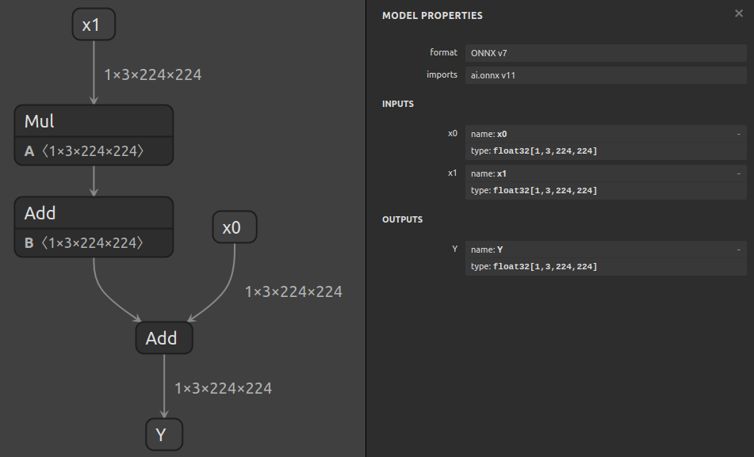

# 使用 Extract 分离子图

## 简介

`surgeon extract` 子工具可用于通过单个命令从模型中提取子图。

在本例中，我们将从一个计算 `Y = x0 + (a * x1 + b)` 的模型中提取一个子图：



假设我们想要分离出计算 `(a * x1 + b)` 的子图，并且我们已经使用 `polygraphy inspect model model.onnx --show layers` 来确定该子图的输入/输出张量的名称，但我们不知道任何相关张量的形状或数据类型。

当形状和数据类型未知时，您可以使用 `auto` 来指示 Polygraphy 尝试自动确定它们。
对于输入，我们必须同时指定形状和数据类型，而输出只需要数据类型 - 因此 `--inputs` 需要 2 个 `auto`，而 `--outputs` 只需要 1 个。

## 运行示例

1.  提取子图：

    ```bash
    polygraphy surgeon extract model.onnx \
        --inputs x1:auto:auto \
        --outputs add_out:auto \
        -o subgraph.onnx
    ```

    如果我们知道形状和/或数据类型，我们可以这样写，例如：

    ```bash
    polygraphy surgeon extract model.onnx \
        --inputs x1:[1,3,224,224]:float32 \
        --outputs add_out:float32 \
        -o subgraph.onnx
    ```

    生成的子图将如下所示：

    

2.  **[可选]** 此时，模型已准备就绪。您可以使用 `inspect model` 来确认它是否看起来正确：

    ```bash
    polygraphy inspect model subgraph.onnx --show layers
    ```

## 关于 `auto` 的说明

当 `auto` 被指定为形状或数据类型时，Polygraphy 依赖 ONNX 形状推断来确定中间张量的形状和数据类型。

在 ONNX 形状推断无法确定形状的情况下，Polygraphy 将使用 ONNX-Runtime 和合成输入数据对模型进行推断。您可以使用 `--model-inputs` 参数控制此输入数据的形状，并使用 `Data Loader` 选项控制其内容。

这将导致生成的子图的输入具有固定的形状。您可以通过在子图上再次使用 extract 命令，并指定相同的输入，但使用具有动态维度的形状，例如 `--inputs identity_out_0:[-1,-1]:auto`，将其更改回动态。
