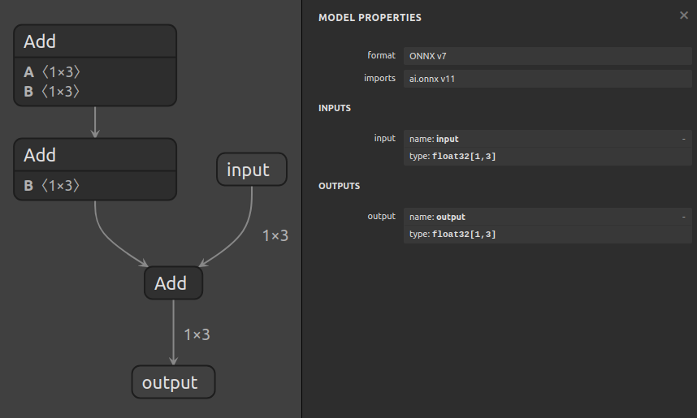
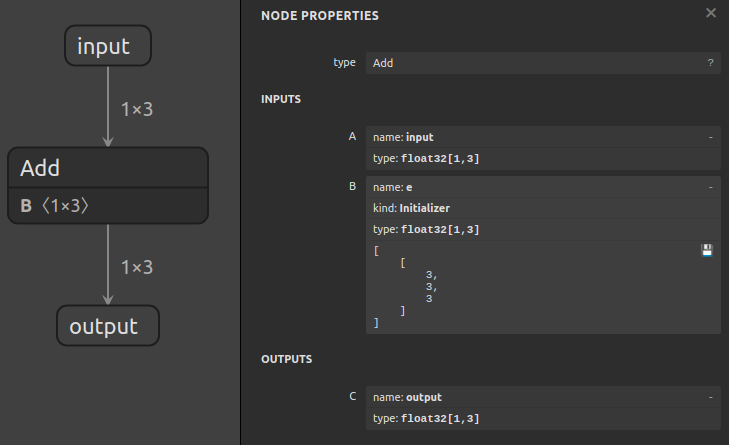

# 使用 Sanitize 折叠常量

## 简介

`surgeon sanitize` 子工具可用于折叠图中的常量、移除未使用的节点以及对节点进行拓扑排序。在形状是静态已知的情况下，它还可以简化涉及形状操作的子图。

在本例中，我们将折叠一个计算 `output = input + ((a + b) + d)` 的图中的常量，其中 `a`、`b` 和 `d` 是常量：



## 运行示例

1.  使用以下命令折叠常量：

    ```bash
    polygraphy surgeon sanitize model.onnx \
        --fold-constants \
        -o folded.onnx
    ```

    这将 `a`、`b` 和 `d` 折叠成一个常量张量，生成的图计算 `output = input + e`：

    

    *提示：有时，模型会包含像 `Tile` 或 `ConstantOfShape` 这样的操作，这些操作可能会生成大的常量张量。折叠这些张量可能会使模型大小膨胀到不希望的程度。您可以使用 `--fold-size-threshold` 来控制要折叠的张量的最大大小（以字节为单位）。任何生成超过此限制的张量的节点都将不会被折叠，而是在运行时计算。*

2.  **[可选]** 您可以使用 `inspect model` 来确认它是否看起来正确：

    ```bash
    polygraphy inspect model folded.onnx --show layers
    ```
